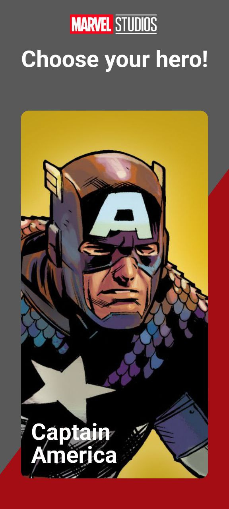
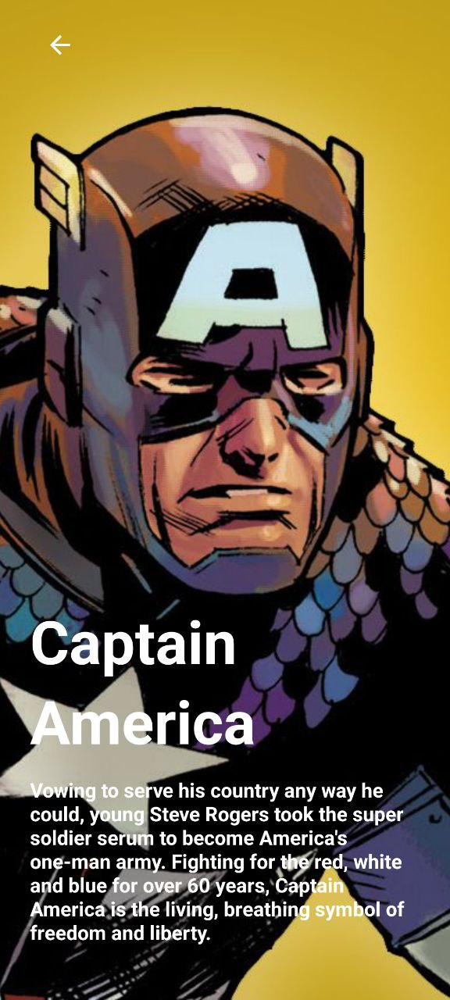
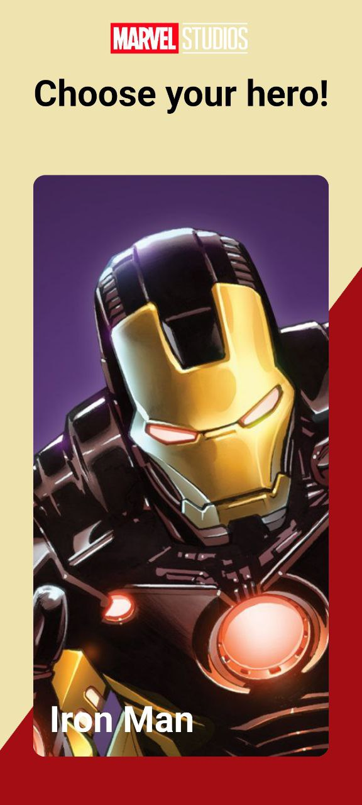
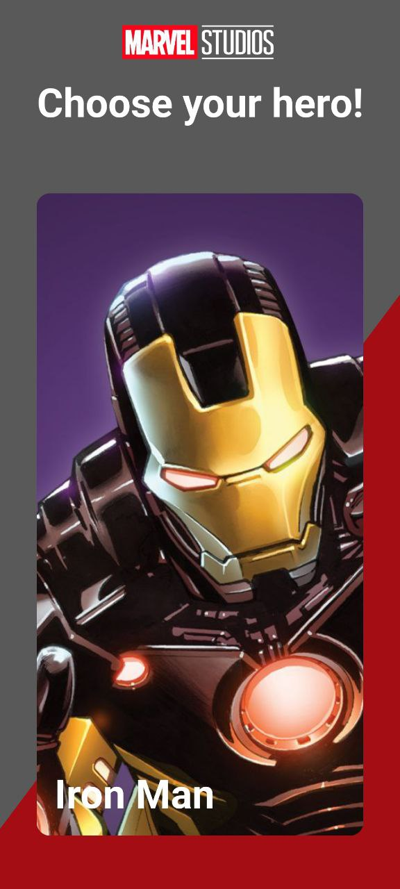

# Marvel Heroes App

## 📱 About the App
This is a demo Android application built with Jetpack Compose and modern architectural patterns. It interacts with the Marvel API to display a list of characters and their details. The project showcases scalable, modular Android development using Kotlin.

## 🧩 Features
* Jetpack Compose UI
* Asynchronous parallel loading of character data using Kotlin Coroutines
* Dependency Injection with Hilt
* Networking with Retrofit and Moshi
* Clean architecture with domain/data/UI separation
* Light and Dark theme support
* Optional local caching (Room/DataStore support ready)

## 🖼️ Screenshots

|                 Characters List                 |                 Character Details                 |
|:-----------------------------------------------:|:-------------------------------------------------:|
|  |  |

|                   Light Theme                   |                   Dark Theme                   |
|:-----------------------------------------------:|:----------------------------------------------:|
|  |  |

## 🛠️ How to Run
1. Install Android Studio (Giraffe or newer) with Kotlin 1.8+
2. Add your Marvel API key to `local.properties`:apiKey=your_marvel_api_key
3. Run the project using **Run → Run 'app'**

## 🧪 Tech Stack
- Jetpack Compose
- Kotlin Coroutines
- Hilt (Dependency Injection)
- Retrofit2 + Moshi (Networking and JSON parsing)
- ViewModel + State handling
- Clean Architecture (multi-layer separation)
- Gradle Kotlin DSL

## ⚠️ Known Issues
- Marvel API has strict rate limits for developers.
- Some character images may disappear if externally hosted logos are removed — recommend hosting on Imgur or GitHub raw content URLs.

## 🧑‍💻 Contacts
- [Islankin Alexander](https://github.com/Sol1dGus)
